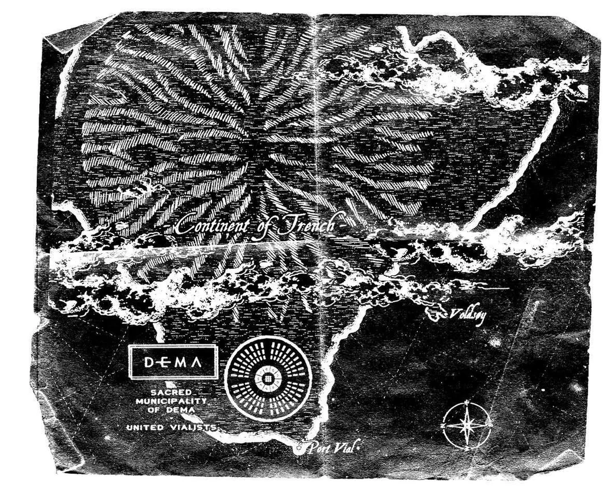
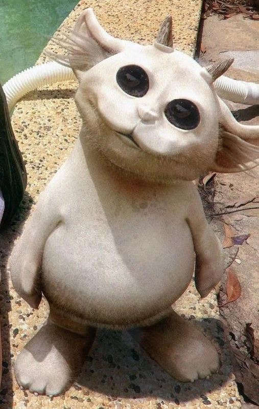

# The World We Live In 

## How it started
the lore hunt started on the website [DEMAORG](http://dmaorg.info/found/15398642_14/clancy.html) where Tyler updated letters written by a man named Clancy relating his life in Dema and his numerous escape attemps

## How does Dema work
people in Dema are lead by bishops, 9 of them to be exact. Their names are __Andre, Lisden, Keons, Nico, Reisdro, Sacarver, Nills, Vetomo and Listo__. They're named after songs from the band, for example, SACARVER comes from the lyrics "She's a carver" (S A CARVER) in the song _Tear In My Heart_  

Every inhabitant in Dema is assigned to a bishop who will watch their every move and make sure they follow the rules.
But what are the rules???
In Dema, everyone follows the same religion: [vialism.](Twentyonepilots/Vialism.md)

## The storyline we follow
Throughout the different albums from the band, we follow the story of Clancy, an inhabitant of Dema who constantly tries to escape the city but gets consistently brought back by his bishop *Nico*
Clancy has lived in Dema his whole life and at one point strated to realise that the bishiops weren't actually the good guys, they did their best to keep inhabitants numb and easy to control. Clancy tried to escape, each time getting further away from the city but he was always broought back by Nico or came back voluntarely because he did'nt know how to live in the wilderness of Trench by himself. That is until he met the banditos, a group of people living outside of Dema who try to help people leave the city.
Clancy gained a reputation in Dema following his numerous escape attempts and  was at one point brought back by Nico and made to entertain the people. He appeared in a show called "Godd day Dema" in which he sang upbeat songs with hidden messages for the rebels.

~~I am a citizen, I am an escapee, I am an exception to the rule, I am Clancy~~

Outside of the main story set in Dema, we have additional information about the area. The story is set on the Continent of Trench, a wild green continent. Throughout the albums, we focus more on a few locations: 
- Dema
- Voldsoy, a wild part of the continent, inhabited by Neds
- the Pladin strait, a body of water separating Dema from Voldsoy    

  
  `This is a picture of a small furry creature with antlers called Ned`
