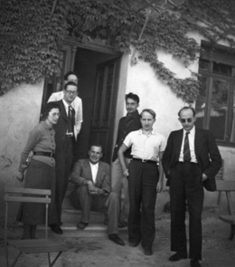

# The World We Explore 

## The Characters
There are a few important names mentioned that you should know before reading this part:  
_Tyler Joseph_, singer, songwriter and at the origin of the Dema story  
_Josh Dun_, drummer of the band, soft boi  
_Clancy_, main character of the Dema storyline, played by Tyler in the music videos  
_Torchbearer_, symbol of hope, member of the Banditos, played by Josh in the music videos  
_Nico/Blurryface_, one of the bishops of Dema, in charge of Tyler, his insecurity is success.  
_Keons_, another bishop in Dema, in charge of Clancy, his insecurity is repetition  

## The storyline we follow
Throughout the different albums from the band, we follow the story of Clancy, an inhabitant of Dema who constantly tries to escape the city but gets consistently brought back by his bishop *Nico*
Clancy has lived in Dema his whole life and at one point strated to realise that the bishiops weren't actually the good guys, they did their best to keep inhabitants numb and easy to control. Clancy tried to escape, each time getting further away from the city but he was always brought back by Nico or came back voluntarely because he didn't know how to live in the wilderness of Trench by himself. That is until he met the banditos, a group of rebells living outside of Dema who try to help people leave the city.
Clancy gained a reputation in Dema following his numerous escape attempts and  was at one point brought back by Nico and made to entertain the people. He appeared in a show called "Godd day Dema" in which he sang upbeat songs with hidden messages for the rebels.

## What's Dema?
Dema is a circular cement city on the continent of trench. It is colorless, hopeless. People in Dema are lead by bishops, 9 of them to be exact. Every bishop represents an insecurity, depending on what your biggest insecurity is, you get assigned a bishop who will watch over you and make sure you follow the rules. 

They're named after songs from the band, for example, the name SACARVER comes from the lyrics "She'S A CARVER" in the song _Tear In My Heart_.  

Here's a table of the important information regarding the bishops  

Name of The Bishop  | Origin of the name in a song  | insecurity 
---------:| :----- |:-----:
Keons      | choke on smoke (_Heavydirtysoul_) | Repetition
Sacarver  | she's a carver (_Tear in My Heart_)| Fear of love
Listo   | a list of people (_Ride_) | Abandonment and overthinking
Lisden   | all I feel is deny (_Polarize_)| Not being enough
Reisdro   | temperature is dropping (_Doubt_) | Self-doubt
Vetomo  | will they be alive tommorow | Conformity
Andre   |and repeat yesterday's dance | Staying the same/ never changing
Nico | he goes by Nico (_Morph_)| Success
Nills | beaten down I'll slip away (_Goner_) | Defeat

## What's vialism?  
The only religion in Dema is Vialism. It is defined by Clancy as a "hijacked religion". It teaches that self destruction (i.e. suicide) is the only way to paradise. Dead people then become available "vessels", bodies to be possessed by the bishops.
When someone dies in Dema, an event called the Annual Assembly of the Glorified happens, where bishops build a neon gravestone for the departed and make everyone watch as the dead is "honored".
&nbsp;
### Vialism or weilism??

   
   Theories about the lore have been attributing vialism to the Bourbaki group, a group of French mathematicians using the name of Nicholas Bourbaki, a fake mathematician (the inspiration for Blurryface's name). The founder of the group was Andre Weil, brother of Simone Weil.   
   
Simone's death was considered a suicide, she starved herself as a way to alert on the starvation french troups faced in war, this was considered a glorious death. She believed that "overtaking your former self" was the only way to truly live.   
   
Tyler has confirmed in april 2024 that the idea of vialism comes from simone Weil's philosophy.

 

~~I am a citizen, I am an escapee, I am an exception, I am Clancy~~

## Additional information

  
Outside of the main story set in Dema, we have additional information about the area. The story is set on the Continent of Trench, a wild green continent. Throughout the albums, we focus more on a few locations: 
- Dema
- Voldsoy, an island East of Dema inhabited by Neds. Ned is the representation of Tyler's Creativity and his Hope. His antlers are the only thing that makes seizing possible.
- the Pladin strait, a body of water separating Dema from Voldsoy. As much as it provides protection for Clancy since the bishops do not cross the strait, it also separates him from the Banditos and makes it harder to fight Dema.

  `This is a picture of a small furry creature with antlers called Ned`  
&nbsp;  
&nbsp;  
&nbsp;  
&nbsp;  
  
## [About the band](theband.md)  
## [How it started, how it's going](moreabout.md)
