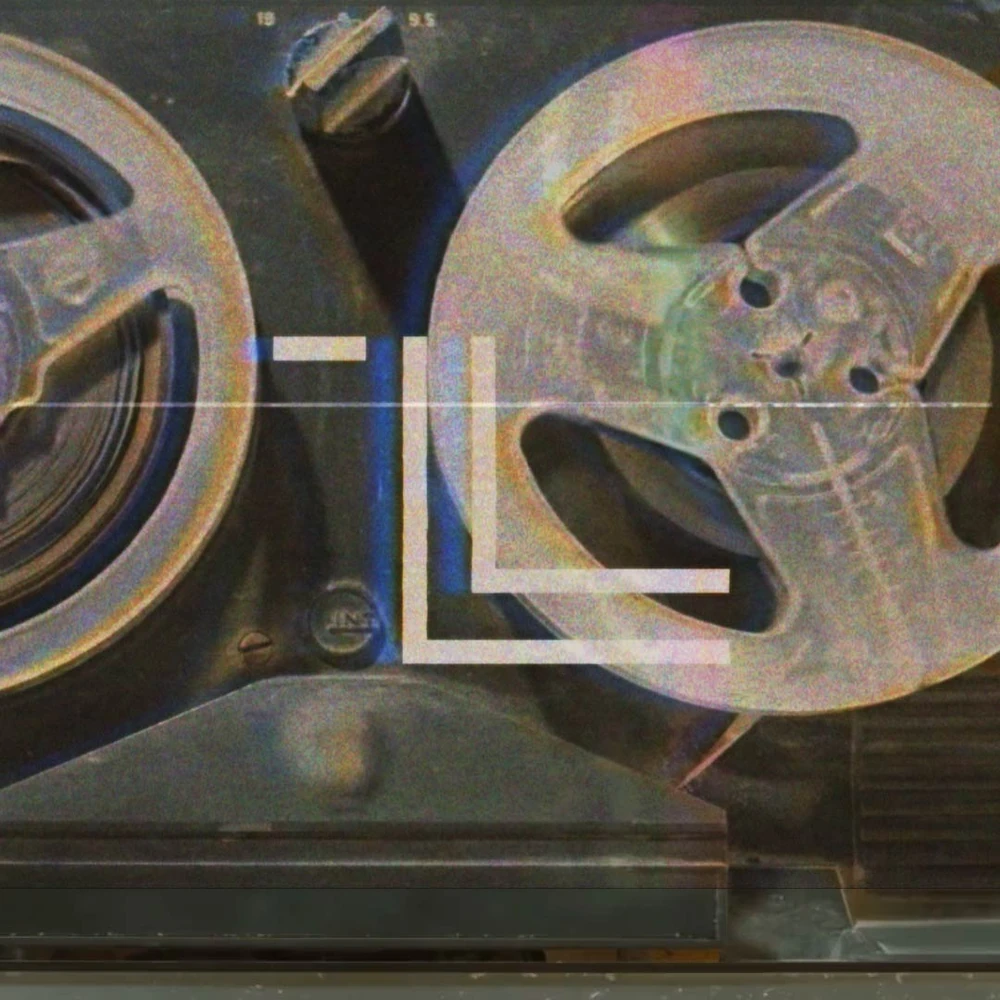

## How it started?
The lore hunt started on the website [DEMAORG](http://dmaorg.info/found/15398642_14/clancy.html) where Tyler Joseph, singer of the band, uploaded lettrs written by someone living in Dema and trying to escape the bishops. These letters are signed _Clancy_, which is the name attributed to the writer although we know it's an Alias (this is explained in the song _Air Catcher_ by the lyrics "Nobody knows his real name but now he jut uses one he stole on a grave"). 
Additional information will be given by the band through subliminal pictures online, music videos, background pictures during live shows...

## Making music during covid
In 2020, Tyler and Josh created a song called _Level Of Concern_ thzt they recorded by sending each other a USB drive by mail since quarantine didn't allow for studio sessions. This is particularly funny considering they are neighbors an can talk to each other from their kitchen windows. 
In June of 2020, Tyler Jospeh started an ARG that had fans looking all around the internet in search of codes that would release clues about the "treasure" they were looking for. A code could be hidden anywhere (on a 2 year old tweet or as morse code in a picture from the merch store for example). Obviously Tyler hid 21 codes for us to find and once they were all put in a particular website, they unlocked a never ending youtube video of their song "Level of Concern" in which fans could appear by submitting any video they wanted to be played.  

Here's an example of one of the LOC file that could be unlocked by one of the codes

## Recent developments
In 2024 , the band released an album called _Clancy_ and included an other online treasure hunt, this time revealing the teaser for an unreleased music video for the song _Paladin Strait_  
Tyler Joseph also recorded a video titled [_I AM CLANCY_](https://youtu.be/ozlHHR_eSxc?si=SjV74KavdDdS8XYA) in which he confirms elements of the lore that clikkies had been wondering about since 2015, like who exactly is Clancy and what is his role in Dema as well as additional information about Vialism.  
During the Clancy tour, letters not from Clancy but from other citizens of Dema are projected on screens, although they have seemingly been ripped by the bishops, we can reassemble the pieces by compiling pictures of the different shows. As the tour is still on the road, we do not have the whole story of these letters yet but we can already tell that their authors have been inspired by Clancy and are now trying to follow in his footsteps. What will happen to them remains to be discovered.  
[The World Explore](Dema.md)  
[about the band](theband.md)
