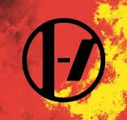

# The band: 
Twenty One Pilots is a two piece band composed of Tyler Joseph, singer, songwriter and pianist, and Josh Dun, drummer. 
The name of the band comes from the play _All My Sons_ by Arthur Miller.
Both members come from the town of Colombus, OH.  
Their fans are called Clikkies and are members of the Clique. 

# Link between the songs and the lore

Album    | total songs  | lore related songs 
---------:| :----- |:-----:
Vessel  2013    |  12 | 3
Blurryface  2015 |    14 | 8
Trench   2018 |     14 | 9
Scaled and Icy  2021  | 11| 6
Clancy   2024   |  13 | 3

# Visuals
Here are the different logos though the Twenty one pilots eras:  
 Blurryface  
 Vessel  
 Trench  
 Scaled And Icy  
 Clancy  
